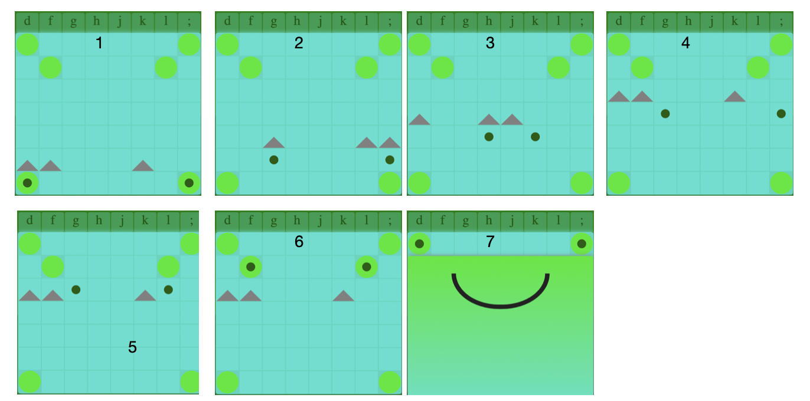
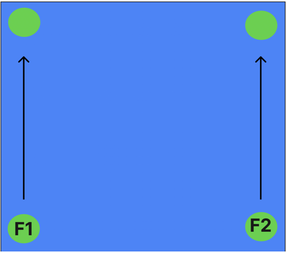

# Froggus-ad-Parnassum

## Introduction

This was my first ever project, undertaken and completed in the 4th week of the General Assembly Software Engineering Immersive (August 2023). The brief was to recreate a classic grid-based game using JavaScript, HTML, and CSS, and to render it in the browser. I recreated Frogger (1981), but added a twist so that it doubles up as a musical improvisation training tool. This was a solo project. 

In classic Frogger, the aim of the game is to move one frog from one end of the grid to the other, avoiding obstacles along the way. In Froggus ad Parnassum, the player moves two frogs at the same time, one with each hand, not only avoiding obstacles (sharks), but ensuring that the frogs remain specific widths apart, according to certain rules. In doing so, the player achieves two things. Firstly, by playing with two hands at once, the player simulates playing a piano. In fact, I assigned each key a musical note so that the player does indeed produce musical sound. Secondly, by maintaining an appropriate width between frogs, the resulting musical harmony abides (with one caveat) by certain rules laid out in Johann Joseph Fux’s famous compositional treatise ‘Gradus ad Parnassum’ (1725). 

## Overview

Part of Fux’s Gradus ad Parnassum takes the student through a series of exercises in a topic called ‘counterpoint.’ Counterpoint trains the student to think carefully about which musical note to play alongside another musical note. Suppose you’re playing the piano and you play one note in the right hand and another note simultaneously in the left. The musical effect you create from the combination of those two notes will vary depending on how wide apart those notes are from one another. Counterpoint trains the student to follow certain rules that are central to the classical music style. Fux arranged his exercises into levels called ‘species’. Froggus ad Parnassum simulates the first level, or ‘first species counterpoint.’ The following sequence of screenshots walks through a possible winning play:



Each frog begins on a lily pad, then leaps into the water, dodging sharks on every row until they reach the last two sets of lily pads on the other side. In the original Frogger, the player can move the frog both vertically and horizontally. In Froggus ad Parnassum, the frogs will automatically be moved up one row with each new move. The player’s job is to decide where they are positioned horizontally, using the key guide above the grid to help them. 

At the start, the frogs span a width of 8 keys (making sure to count the keys on which the frogs themselves are positioned). The frogs adopt the same width on the final row. This is in accordance Fux’s rule that voices in first species should begin and end 8 notes apart. Similarly, following another Fuxian rule, in the second to last row, the player must land on the lily pads that are aligned with the ‘f’ key and ‘l’ key respectively.

In the middle rows, there is more choice, but there are still constraints. Generally, in these rows, the width between the frogs should be either 3 keys or 6 keys. Fux did permit the occasional use of a 5-key width and an 8-key width in the middle (see stage 5 in the example above). In Froggus ad Parnassum, players are allowed to do this ONCE in the middle rows, but any more times and they will lose the game.

To encourage quick thinking (which is an important skill in the mastery of musical improvisation), players are timed from the moment they play the first move. The top ten fastest times are added to a leaderboard.

## Document and Reflecting on the Planning Process

In preparation for this project, I produced a five-and-a-half-page planning document for my instructors to review, which is reproduced as an appendix to this README. In this plan, I fleshed out the concept of the game, using wireframes made on figma.com. I also anticipated various technical challenges and provided initial normal-language solutions for them. 

Ultimately, the final concept remained the same as the plan, except for one subtle but significant difference. In the planning stages, I wanted to build the game such that the player was forced to play “in time”, by following either a visual or audio metronome. The motivation behind this was that I wanted to simulate musical playing as much as possible, and keeping good time is, of course, an important aspect of playing musically. However, even though I did in fact build a function to encourage metronomic playing, I ended up discarding it and replacing it with a ‘high score’ feature that encouraged players not to play metronomically but instead to complete the game as quickly as possible. Not only did I find this more fun (and more addictive), but I felt it could also help develop another important musical skill, which is the ability to think ahead and to think quickly.

On the coding front, technical challenges I had anticipated and discussed in the plan for the most part had solutions that were broadly similar to the ones I had outlined, although, in practice, these solutions often turned out to be more complex (and interesting!) than I had expected. Some of these solutions will be discussed in more detail below.

## Key Features

### The Musical Keyboard

The key guide that was placed above the grid (see above) is a copy of an 8-element ‘originalGridWidth’ array that I initialised as a constant at the start of my JavaScript document: 

originalGridWidth = [‘d’, ‘f’, ‘g’, ‘h’, ‘j’, ‘k’, ‘l’, ‘;’]

Separately, I made audio recordings of 8 musical notes and used a for loop to push them into an array called ‘soundArray’:

```
for (let i = 1; i <= originalGridWidth.length; i++) {
  let audio = document.createElement('audio')
  audio.src = `note-${i}.m4a`
  soundArray.push(audio)
}
```
Doing this meant that I now had an array of musical notes that matched the width of my grid. Using the addEventListener method for ‘keydown’ and ‘keyup’, I could detect when a key was being pressed down and when it was being released. I then wrote a ‘playSound’ and ‘stopSound’ function that found which element in the originalGridWidth array matched the specific key being pressed, and then matched the index of that key to the same index in soundArray, thus producing (or pausing) the appropriate musical note:

```
function playSound (event) {
  soundArray[originalGridWidth.indexOf(event.key)].play ()
}

function stopSound (event) {
  soundArray[originalGridWidth.indexOf(event.key)].pause ()
}
```

### Ensuring Two Simultaneous Key Presses

As mentioned, in first-species counterpoint, you can think of the right hand as playing a sort of melody, while, for every note in that melody, the left hand plays another note at the same time. Playing with both hands at the same time is central to the musical exercise, which is why this game features two frogs not one, and why the game requires the frogs to move at the same time as one another.

However, ensuring that two (and only two) keys are being pressed at the same time is not straightforward. This is because JavaScript’s addEventListener method can only detect one key press at a time. So, for example, if a player presses the keys “d” and “g’’ at the “same time”, JavaScript will detect which one was pressed fractionally ahead of the other, respond to that one first, and then respond to the other. Given that JavaScript only processes one keypress at a time, how can one incentivise the player to nevertheless try and play both keys together?

To solve this, I made an empty array called ‘currentMove.' When a key was pressed down, a function called ‘checkMove’ (see below) would push that key into the currentMove array. As soon as the currentMove array contained two items, the rest of the checkMove function would execute, measuring the musical interval between these two keys to assess the validity of the move. However, this alone still would not ensure that the two keys were ever sounding at the same time. Therefore, I wrote an ‘emptyCurrentMove’ function and attached it to the ‘keyup’ eventListener. As a result, if the listener lifted up the first key before pressing down the second, the currentMove array would empty and the player’s move would not be completed (because a move can only be made once currentMove.length === 2).

To be clear, this could be refined further. Strictly speaking, all this really checks for is that at some point, both keys are being pressed down at the same time. It doesn’t set any limitation on how long the player must take to press down the second key after the first has gone down. Remember, no two key presses are ever exactly simultaneous, but there are still psychoacoustic limits to how far apart two events can occur in time before they sound either non-adjacent or, worse, “not-related,” so it would certainly be preferred if the player were to stay within those constraints. 

This could easily be addressed in the following way. Let’s say we wanted to insist that the two keys had to be pressed within 20ms of one another. Using the getTime method, we could record the time of the first keypress, record the time of the second keypress (ie, when currentMove.length === 2), subtract the first value from the second, and if the answer is less than 20, the move is valid, otherwise it is invalid. My reason for not including this feature in the final version of the game was that, once I introduced the high score table to incentivise players to complete the game in the fastest possible time, it no longer seemed necessary to check that players weren’t dawdling between keypresses. 

### The Grid

The grid was made using the CSS grid layout. Instead of hard-coding width and height values, these values were defined in reference to variables. This was done so that, if I ever want to extend the game such that there are several levels involving wider and taller grids,  these values could be updated easily, maybe even by the players themselves. 

The ‘createGrid’ function was called inside the ‘startGame’ function, which was called every time the start button was pressed. To prevent new grids spawning on the page every time the button was clicked, I wrapped the bulk of createGrid in a conditional which checked whether or not the grid had already been made on a previous click.

```
function createGrid (width, height) {
  if (gridMade === false) {
    grid.style.gridTemplateRows = `repeat(${height}, 1fr)`
    grid.style.gridTemplateColumns = `repeat(${width}, 1fr)`
    for (let i = 0; i < width * height; i++){
      const square = document.createElement('div')
      square.classList.add('square')
      square.id = i
      if (i === 0 || i === width - 1 || i === width * (height - 1) || i === width * height - 1 || i === width + 1 || i === width * 2 - 2) {
        square.classList.add('lilypad')
      }
      grid.appendChild(square)
    }
  }
  gridMade = true
}
```

### Creating Sharks

Without the sharks, the game would be too easy and there would be no reason for thinking creatively and seeking different paths through the water. That said, with a grid that is 8 keys wide, if the number of sharks per row is always 3, there will always be a way through. 

The sharks positions are generated randomly, using three functions: ‘changeAvailableKeys’, ‘makeRandomRow’, and ‘createSharks.’ I mentioned in the introduction that there was one caveat to my claim that this game simulates Fux’s rules. The caveat is that Fux encouraged ’smooth’ writing, where notes (or frogs) for the most part proceed to nearby positions, avoiding leaps. With sharks randomly appearing at different locations, that is not always possible. 

changeAvailableKeys is called after every move. Its role is to change the elements contained in the availableKeys array. Whatever its current state, the availableKeys array is always a subarray of originalGridWidth, which, as you may remember, contains all the keys in the musical keyboard. In the first row, the last row, and the second to last row, availableKeys only contains two elements, which correspond to the green lily pads you can see on the grid. In the middle rows, availableKeys contains 5 randomly selected elements.

When createRandomRow is first called, availableKeys is emptied. Then, createRandomRow randomly selects an element from originalGridWidth before looking to see if that element is already contained in availableKeys. If it is not, it pushes that element into availableKeys. Because of the randomness, it is not possible to know how many attempts it will take createRandomRow to successfully pass an element into availableKeys. For this reason, the function was made to be recursive, so that it will continue to call itself until availableKeys contains five unique elements:

```
function makeRandomRow () {
  let randomNum = (Math.floor(Math.random() * originalGridWidth.length))
  if (!availableKeys.includes(originalGridWidth[randomNum]) && availableKeys.length < 5) {
    availableKeys.push(originalGridWidth[randomNum])
    makeRandomRow ()
  } else if (availableKeys.includes(originalGridWidth[randomNum]) && availableKeys.length < 5) {
    makeRandomRow ()
  }
  else if (availableKeys.length === 5) {
    createSharks()
  }
```
createSharks then simply fills an array called sharkSquares with all the elements from originalGridWidth that did not make it into availableKeys before using the classList.add method to style those squares with a grey, shark-like triangle. To make the shark styling, the 50px x 50px grid squares were actually made by first making a square of 0px x 0px, then adding a 25px border and styling the border bottom with in grey. At the top of createSharks, all previous shark squares are removed:

```
function createSharks () {
  let removeCurrentSharks = document.querySelectorAll('.shark') 
  removeCurrentSharks.forEach(item => {
    item.classList.remove('shark')
  })
  sharkSquares = originalGridWidth.filter(item => {
    return !availableKeys.includes(item)
  })
  sharkSquares = sharkSquares.map(item => {
    return originalGridWidth.indexOf(item)
  })
  sharkSquares = sharkSquares.map(item => {
    return (gridHeight - (currentRow + 1)) * originalGridWidth.length + item
  })
  sharkSquares.forEach(item => {
    shark = document.getElementById(`${item}`)
    shark.classList.add('shark')
  })
}
```

### The checkMove Function

The checkMove function is the heart of the game. Not only does it check the validity of the player’s latest move, but it updates important values such as the ‘currentRow’ variable (which dictates the frogs’ vertical position and the validity of certain moves), the ‘frogLives’ variable, and the startTime and stopTime variables.

Essentially, the function measures the distance between the frogs to check that they are an appropriate width apart. It does this by subtracting one value in the currentMove array from the other and then squaring the result. The reason the result is squared the currentMove array is not sorted. Instead, the first element in currentMove is simply the first key that the player happened to press down (more on this below). Suppose we were comparing the distance from ‘f’ to ‘l’. Subtracting ‘f’ from ‘l’ would produce a positive number, but subtracting ‘l’ from ‘f’ would produce a negative number. In other words, on different occasions, we could obtain different results even though the two elements are the same. By squaring the result, we always obtain a positive number, and then this number can be checked to see if it relates to a valid width. For instance, if the result of one such calculation is 25, we know that the width between the keys is 6. Depending on the result of these calculations and the value of currentRow, various functions might be subsequently called, such as the ‘winScreen’ or ‘loseScreen’ function at the end of the game: 

```
function checkMove (event) {
  if (availableKeys.includes(event.key)){
    currentMove.push(originalGridWidth.indexOf(event.key))
    if (currentMove.length === 2) {
      if (currentRow === 0 ) {
        startTime = new Date ()
        startTime = startTime.getTime() // The starts a timer from the moment player takes their first move
        currentRow++
      } 
      else if (currentRow > 0 && currentRow < gridHeight - 2) {
        if ((currentMove[1] - currentMove[0]) ** 2 === 4 || (currentMove[1] - currentMove[0]) ** 2 === 25) {
          currentRow++
        } 
        else if ((currentMove[1] - currentMove[0]) ** 2 === 16 || (currentMove[1] - currentMove[0]) ** 2 === 49) {
          currentRow++
          frogLives--
        }
        else {
          loseScreen()
        }
      }
      else if (currentRow === gridHeight - 2) {
        currentRow++
      }
      else if (currentRow === gridHeight - 1) {
        currentRow++
        stopTime = new Date ()
        stopTime = stopTime.getTime() // Records what time the player completed the game
        winScreen()
        setTimeout(calculateTime, 1000) // This timeout is to ensure that the highscore prompt doesn't load too quickly after the game has finished
      }
      else {
        loseScreen()
      } 
      changeAvailableKeys() // Calling changeAvailableKeys here ensures that a new set of availableKeys is generated for each of the middle rows
    }
  }
  else {
    loseScreen() 
  }  
}
```

### Making the Frogs Glide

For aesthetic reasons, I wanted the frogs to glide to their new positions instead of instantaneously respawning in a new square. This presented a challenge because I could not rely on the CSS grid layout that I had used to form the actual grid.

Instead, I used absolute and relative positioning, where frogs where directed to absolute positions different relative to the grid container. For now, let’s just imagine how we would accomplish this with just one frog. Taking the left-hand frog, I wanted it to begin the game in the middle of the bottom left-hand square. The frog has a diameter of 20px, while the square is 50px x 50px. Therefore, within this square, there is 30px of free space along both axes.To centre the frog, this space needs to be split evenly, which means putting 15px space on either side. Accordingly, the frog begins with the coordinates ‘left: 15px;’ and ‘bottom: 15px;’. 

As mentioned, each square is 50px x 50px, but, in addition, there is also a 2px gap between each adjacent square. Therefore, along either axis, for the frog to move to the centre of the next square, it would need to move 52px. To move, say, two squares to the right, the frog would need to increase its ‘left’ position by 2 x 52px (‘left: 104px;’). Taking this logic, I used a for loop to generate an array of values that are multiples of 52 + 15:

```
for (let i = 0; i < originalGridWidth.length; i++) {
  let x = 15 + i * 52
  frogMap.push(x)
}
```

frogMap = [15, 67, 119, 171, 223, 275, 327, 379]
originalGridWidth = [‘d’, ‘f’, ‘g’, ‘h’, ‘j’, ‘k’, ‘l’, ‘;’]

Each pixel location now had an index number which matched the index number of a particular key in the originalGridWidth array. Suppose then, that ‘g’ was pressed. This being index[2] of originalGridWidth, I used the makeMove function to send the frog to frogMap[2], updating its position to ‘left: 119;’. Meanwhile, I updated the vertical position updating the ‘bottom’ value up by one further position through the array. To all this, I simply added the transition property in CSS, which was what ultimately made the frog glide. 

Lastly, I needed to ensure that JavaScript ‘knew’ which pixel location related to which frog; otherwise, there would likely be situations where the frogs swap places, which, musically, wouldn’t make much sense. To address this, for every move, I pushed the two location indexes into the frogLocation array and sorted them in ascending order. Then, I could consistently apply the frogLocation[0] to the left frog and frogLocation[1] to the right:

```
function makeMove (event) {
  frogLocation.push(originalGridWidth.indexOf(event.key))
  if (frogLocation.length === 2) {
    frogLocation.sort()
    frog1.style.left = `${frogMap[frogLocation[0]]}px`
    frog2.style.left = `${frogMap[frogLocation[1]]}px`
    frog1.style.bottom = `${frogMap[currentRow - 1]}px`
    frog2.style.bottom = `${frogMap[currentRow - 1]}px`
    frogLocation = []
  }
}
```

### The Random Demo Feature

As an additional tutorial feature, the player can watch JavaScript execute a demonstration play. In this play, not only are the sharks randomly generated (as in the game itself), but the moves themselves are randomly selected from an array of valid moves, using a function called ‘demoMove.’

As in the game itself, the moves for the first row, last row, and second to last row are predetermined while there is a range of possible choices in the middle rows. In demoMove, a nested for loop is used to look at every possible pairing of elements in availableKeys. If a pairing is found produce a valid move, that pair is pushed into the ‘currentOptions’ array. Once all valid pairs have been pushed, one of them is randomly selected from curentOptions and becomes the chosen move. 

(In the demo feature, I didn’t include the one-off allowance for a key width of 5 or 8, though this would not be difficult to implement.)

Lastly, a separate ‘playDemo’ function is used which uses the setInterval method to trigger demoMove once every 1000ms for the duration of the demonstration. playDemo also disables the start button and the demonstration button for the duration of the demonstration, to prevent overlapping games being played, which would producing confusing results:

```
function demoMove () {
  currentMove = []
  if (currentRow === 0 || currentRow === gridHeight - 2 || currentRow === gridHeight - 1) {
    currentMove[0] = availableKeys[0]
    currentMove[1] = availableKeys[1]
  }
  else if (currentRow > 0 && currentRow < gridHeight - 2) {
    currentMove = []
    currentOptions = []
    for (let i = 0; i < availableKeys.length; i++) {
      for (let j = 0; j < availableKeys.length; j++) { 
        if( i !== j) {
          let current1 = originalGridWidth.indexOf(availableKeys[i])
          let current2 = originalGridWidth.indexOf(availableKeys[j])
          let answer = (current1 - current2) ** 2  
          if (answer === 4 || answer === 25) {
            currentMove[0] = availableKeys[i]
            currentMove[1] = availableKeys[j]
            currentOptions.push(currentMove)
          }
        }        
      }
    }
    createRandomNumber()
    currentMove = currentOptions[randomNumber]   
  }
  if (currentRow === gridHeight) {
    winScreen()
    clearInterval(demoTimer) 
    demonstration.addEventListener('click', playDemo) 
    startButton.addEventListener('click', startGame)
  }
  playDemoSound ()
  demoFrogMove ()
  currentRow++
  changeAvailableKeys()
}
```

The demoMove function acted in conjunction with ‘demoFrogMove’ and ‘playDemosound’ such that the demonstration also features moving frogs and musical sounds. playDemoSound acts in concert with ‘stopDemoSound’ which prevents the musical notes from playing continuously once sounded. Because there is nothing in the rules to prevent consecutive moves being identical, there are occasionally moments when the demoMove will call the same move twice. If there is no audible gap between two adjacent identical note selections, the notes will sound joined together, which sounds slightly unusual. To prevent this, I used the setTimeout method call stopDemoSound automatically 900ms after playDemoSound. Because playDemoSound is triggered every 1000ms, this guarantees a 100ms gap between every note onset.

### The High Score Leaderboard

A high score leaderboard was included to encourage players to complete the game as quickly as possible, to develop their improvisational ability. This leaderboard permanently stores the 10 fastest times and the player name (received from a prompt) ever in the local browser, using the local storage feature in Chrome DevTools. 

Local storage stores key-value pairs. The key is used to retrieve the value, and the value is returned as a string. Personally, I found it easiest to store all the information about all the players as a single value, which I called using the key ‘highscores.’ This large string was retrieved every time a player completed the game. Once retrieved, it was firstly converted to an array called ‘highScoreTable.’ Each element in this array contained information about the player and their time. Then I extracted the numbers (the fastest times) from this array and stored them in a separate variable called ‘highScoreNumbers.’

JavaScript then compared the player’s latest time with the slowest time in highScoreNumbers and, if it was faster, it was added to highScoreNumbers. I then used a nested for loop to execute a bubble sort on highScoreNumbers, fastest (lowest) to slowest (highest). In parallel, I also re-sorted highScoreTable before popping the last element to return the array length to 10. After updating the HTML innerText to display the new leaderboard, I then used the JSON.stringify method to re-string the array and sent it back to local storage.

In hindsight, it seems inefficient to have called it every time a player completes the game. While this is okay because the data set is small, a more efficient approach would be needed for something larger.  A more efficient approach would be to store the slowest time from the leaderboard in a separate array, and check this time with the latest time. Only if the latest time is faster than this time should the rest of the leaderboard be retrieved from local storage.

```
function addTopScore (time) {
  let highScoreTable = JSON.parse(localStorage.getItem('highscores')) || 'initialHighScore: 100.0' 
  if (typeof highScoreTable === 'string') {
    highScoreTable = highScoreTable.split(',')
  }
  let highScoreNumbers = highScoreTable.map(item => {
    return parseFloat(item.match(/\d+\.\d+/))
  })
  if (highScoreTable.length < 10 || time < highScoreNumbers[highScoreNumbers.length - 1]) {
    let player = prompt('Congratulations! Please enter your frog name to be added to the leaderboard: ')
    let newHighScore = new Player (player, time)
    newHighScore = JSON.stringify(newHighScore)
    newHighScore = newHighScore.split('"')
    newHighScore = newHighScore.filter(item => {
      return item === newHighScore[3] || item === newHighScore[7]
    })
    newHighScore = newHighScore.toString()
    newHighScore = newHighScore.replace(',', ': ')
    highScoreTable.push(newHighScore)
    highScoreNumbers = highScoreTable.map(item => {
      return parseFloat(item.match(/\d+\.\d+/))
    })
    let numberHolder
    let allInfoHolder
    for (let i = 0; i < highScoreNumbers.length; i++) {
      for (let j = 0; j < highScoreNumbers.length - 1; j++) {
        if (highScoreNumbers[j] > highScoreNumbers[j + 1]) {
          numberHolder = highScoreNumbers[j]
          highScoreNumbers[j] = highScoreNumbers[j + 1]
          highScoreNumbers[j + 1] = numberHolder
          allInfoHolder = highScoreTable[j]
          highScoreTable[j] = highScoreTable[j + 1]
          highScoreTable[j + 1] = allInfoHolder
        }
      }
    }
    if (highScoreTable.length > 10) {
      highScoreTable.pop()
    }
    for (let i = 0; i < highScoreTable.length; i++) {
      let position = document.getElementById(`list${i}`)
      position.innerText = `${highScoreTable[i]}s`
    }
    localStorage.setItem('highscores', JSON.stringify(highScoreTable)) 
  }
}
```

## Bugs

### Sound Issues in Safari

During the coding process, the page was being tested on Google Chrome. Later, I discovered that the sound did not work so well on Safari. While the audio files played fine during the demonstration, they did not work, or only played sporadically during the actual game.

### Unpredictable CSS

The returnFrogs function was called whenever the game finished and was intended to ensure that the frogs always moved to the final lily pads when the game was over, even when the player lost. This was desired because the ‘frogs’ became the ‘eyes’ of a larger frog that appeared in the endScreen. However, the frogs did not always make it:

```
function returnFrogs () {
  endScreen.style.display = 'block'
  frog1.style.left = `${frogMap[0]}px`
  frog2.style.left = `${frogMap[7]}px`
  frog1.style.bottom = `${frogMap[6]}px`
  frog2.style.bottom = `${frogMap[6]}px`
  frogLocation = []
}
```

In addition, there were several occasions where the frogs moved to unexpected locations, and, while I was able to make adjustments in the code, I did not always understand why the adjustments were necessary. For instance, at the end of the game, the frogs sometimes floated out of the grid, either above or below it. Instead of gaining insight into the true cause of the problem, I simply adjusted the numbers so that the frogs were sent to a higher or lower row from the one I had expected them to go to.

## Learning Takeaways

During the course of the project, I identified what I believe to be several areas that would need to be addressed to take the quality of the code to the next level. These are:

1. Understanding Browser Differences: Clearly, the web page behaves differently in different browsers, and, currently, I don’t know the reasons for this. Interestingly, in a late draft of this code, I tried removing the JSON.parse method from the top of my addTopScore function because it appeared to me that it could be redundant (just a vestige of an earlier form of the function that I had been working on). However, removing it completely produced strange results in Safari, where the leaderboard featured numerous unexpected and undesired characters, such as brackets, quotation marks, and dashes. Reinserting JSON.parse removed these once more.
2. Understanding Local Storage: While I was proud to have figured out a way to use the local storage in the creation of the leaderboard, the addTopScore function that I ended up writing felt somewhat like a hack, and, without knowing more, I can’t help suspecting there is a more elegant and efficient way to use it.
3. Controlling CSS: As mentioned above, CSS still throws up surprises, indicating that my understanding of some of its concepts is still not quite right. To date, CSS has largely been learnt “as I’ve gone along,” and I would like to set aside the time to establish a more secure foundational knowledge of the language.
4. Improving Semantic Markup and Aria Labels in HTML: Given this was a game (as opposed to something more text-based), it was not always obvious to me how best to deploy semantic markup. When it came to HTML, more often than not, my main concern was making sure that containers were nested such that I could arrange them easily in CSS, but semantic markup is a separate issue from that, which I need to understand better. Similarly, my use of aria labels and other features to promote accessibility was sporadic as a result of my understanding of them being somewhat patchy.

## Future Improvements

### Connecting to a Digital Piano

For this game to be truly useful to a training musician, it would need to be connected to a proper musical instrument, such as a digital piano. Even with no further improvements to the audio quality, the tactile change would make the experience feel more musical. 

### Using MIDI

The audio recordings of the musical notes are of low quality. An improvement would instead use MIDI sounds. The recordings are of a fixed duration - were the player to hold key down for more than a few seconds, the note would stop sounding. This would not happen with MIDI, which would continue to sound for as long as the key is pressed. Furthermore, MIDI could also give greater flexibility with regard to timbre (sound quality) and dynamics (volume).

### Increasing the Width and Height of the Grid

Given the fairly narrow width of the grid, the player is unable to utilise the range of high to low pitches that would be typical for a species counterpoint exercise. The key range of ‘d’ to ‘;’ was chosen so that there is room for two more keys on either side, using a desktop keyboard. Another advantage of using a digital piano would obviously be that its range is far greater than a computer desktop. One challenge of making the grid wider would be that the number of sharks per row would need to increase in order for it to remain challenging. However, while it was easy to see how 3 sharks for an 8-row grid was a good number, increasing the grid size could demand some more complex mathematics in order to ensure there is always a solution while keeping the game sufficiently challenging. Another challenge that would arise from increasing the grid is that it would likely become visually harder to judge the locations of the sharks on the row, and thus harder to select appropriate keys for the frogs. There is no obvious musical benefit to such a challenge, and, as such, could become an undesirable nuisance for the player.

By increasing the height of the grid the game could be made longer. This would be an improvement because, by making the game longer, the player is forced to concentrate for longer, which is another good skill to develop for musical improvisation. However, this could introduce the need for a moving grid in order that the longer grid remains visible on the page. 

### Introducing More Complex Rules

Another limitation that prevents the current version of the game from being truly useful to a training musician is that it only covers first species counterpoint. Furthermore, it only covers first species counterpoint with 2 voices, whereas, traditionally, one would learn to work with up to 4 voices. How the game could be complexified to include more voices and more higher species remains unclear to me at the moment. Nevertheless, given that this much was possible, there is no a priori reason to think that more complex versions could not be worked out in the future. 

## Appendix: Frogger Plan

# Froggus ad Parnassum

## Background and Concept

### Personal Motivation

Given my background in music education, it is possible that, after the GA course, I may apply for jobs in music tech. One area of music tech that I am interested in concerns technology that aids education. With that in mind, I would like to treat this first project as an opportunity to build a game that is also educational.

### Historical Background

What makes any given style of music sound like that style of music? What makes rock sound like rock, or heavy metal like heavy metal? In part, what gives a particular style its particular sound is the particular instruments that it uses, or the particular sound quality of the singer. But another important feature of musical style is the patterns of the notes. Different styles of music draw on different patterns, and these patterns can be codified into rules that music students learn through practice. 

Classical music has rules for which notes can be played at the same time as other notes. Think of a sheet of music and all the dots on the page. The dots are the notes, and when two dots are drawn on top of each other, they are played at the same time. We need rules for this because you can’t just play any note with any other note. Some pairs of notes will sound harmonious, but others will clash horribly, and we only want that in certain situations. The study of these rules is called counterpoint, which basically means “note against note" (counter —> contra; point —> dot —> note; counterpoint —> “against note” or “note against note”).

In 1725, a composer and theorist called Johann Joseph Fux set these rules out in a treatise called Gradus ad Parnassum, which means “Steps to Mount Parnassus”. Mount Parnassus is a mountain in Greece, so the implication of the title is “read my book and you will ascend to greatness.” This is a bit of a stretch, but, nevertheless, it’s still a good book. In fact, to this day, Fux’s book is still used in universities across Europe and America.

### Concept in Brief

In Froggus ad Parnassum, we will “leapfrog to greatness” by harnessing the addictive fun of a classic arcade game. In short, the 1981 game Frogger will be adapted in such a way that the person playing it will unwittingly be “playing” their computer keyboard like a musical keyboard, following the rules of Fuxian counterpoint. 

## Concept in Detail 

Example 1: The goal is to transport two frogs from one end to the other. 



In classic Frogger, your goal is to safely transport one frog from the bottom of the screen to the top of the screen. In Froggus ad Parnassum, you have to transport two frogs, controlling one with each hand. 

The game begins as soon as the player makes their first move. In classic Frogger, you can use the arrow keys to move up, down, left, or right. In Froggus ad Parnassum, the controls are a bit different. The frogs will be moved upwards automatically every second or so. Before then, for each go, the player must press two keys from the following array: ASDFGHJK. You will notice that these 8 keys form a horizontal row on your keyboard. The two keys tell frogs which square to occupy in the next row. A new lily pad will appear, and the frogs can hop on safely. Because they belong to an array, each key will have an index number - the key with the lower index number will be assigned to the left-hand frog, while the key with the higher-index number will be assigned to the higher frog.

Example 2: Frogs will automatically be moved up every second or so. The player chooses which square to put the frogs by pressing a particular key.

![Picture of the grid where each 8-square row is filled in with the letters A-K from the qwerty keyboard] 

Let’s look at an example of a journey these frogs might make:

Example 3: A possible journey for our frogs. For each numbered row, try pressing the two keys at the same time. Notice how it’s a bit like playing a piano piece with two hands.

![Picture showing one solution to the game]

Let’s analyse these moves in a bit more detail. First of all, notice how the game starts and ends with [A, K]. If you count the squares from A to K inclusive, you will count 8. This is deliberate - in classical music, a span of 8 spaces is called an octave, and in Fuxian counterpoint, we always begin and end with an octave.

Now let’s count distances between the keys on each successive row (again, counting inclusively). You will find that, without exception, each pair of keys is either 3 squares or 6 squares apart. In classical music, we call these spans intervals, and, in Fuxian counterpoint, the rule is that, when you’re in the middle of a musical phrase, the interval must be a “3rd” (3) or a “6th” (6). In other words, our frogs must always be 3 or 6 squares apart from each other. 

Now, if that was all there was to this game, the game would be pretty easy, and pretty boring. For example, you could just do the following:

Example 4: A boring solution

![Picture of a boring solution]

To address this, let’s add a new feature to the game. For every row, let’s randomly assign some sharks to different squares. Now the frogs have to dodge that shark, or else they’re going to be eaten.

Example 5: Randomly assigned sharks that need to be avoided

![Picture of randomly-assigned shark squares]

Example 6: A solution that avoids the sharks

![Picture demonstrating a new solutiont to the game]

That’s almost all the basics, except for one more thing: every time the frogs move onto their new squares, two sounds will play. Those sounds will be musical notes - the very notes you would hear if you actually played this pattern on a musical keyboard. Congratulations, you are now playing classical music!

## Technical Challenges

### Making a Move

For each move, the player must select two elements from an array - [A, S, D, F, G, H, J, K]. Whether or not their move is valid depends on the distance (the musical interval) between these two elements. This can be determined by subtracting the index of the larger element from that of the lower one. Remember, apart from the beginning and the end, we need the frogs to be separated by a musical interval of a 3rd or a 6th. Slightly confusingly, because musical intervals count inclusively, we have to subtract one to get the actual distance between musical notes. In other words, musical notes that are a “6th” apart are actually just 5 notes apart, counting the normal way. Therefore, the valid distances between frogs are 2 and 5 during the middle of the game, and 7 for the beginning and end. 

For example, given the array [A, S, D, F, G, H, J, K], suppose a player selects the keys D and K in the middle of the game, we can use the indexOf array method to find their respective indices (1, 6). Then, we subtract the larger from the smaller, and if the answer is 5 or 2, the move is valid.

It turns out that, for an array of 8 elements, there are 9 valid moves:

[A, D]
[S, F]
[D, G]
[F, H]
[G, J]
[H, K]
[A, H]
[S, J]
[D, K]

As a result, all Javascript needs to do, is check whether or not one of these combinations has been executed by the player.

### Winning the Game

Given a grid of height 7, the player must make 7 correct moves in order to win. For each move, they will only have a short amount of time to make their decision. If the player succeeds, the game could be regenerated in such a way as to introduce new challenges.

The game could be made harder by: 

1. Introducing more sharks, including surprise sharks that only emerge mid-game
2. Reducing the amount of thinking time
3. Lengthening the grid to demand concentration for longer lengths of time
4. Widening the grid to create the possibility for more varied solutions

Related to point 4, it should be noted that the rules described above are somewhat simplified from the actual rules set by Fux. In fact, although intervals 3rds and 6ths are strongly favoured, 5ths and 8ths are also permitted when necessary. In harder levels, we could allow players to uses 5ths and 8ths, but set a condition such that the frogs’ “health” is diminished whenever they do so. If a frogs’ health diminishes too much, they will die and the game will be over.

### Listening For Two Keys at Once

As much as possible, we want the experience of this game to simulate the experience of playing a musical keyboard in real time. Therefore, it really matters when the player plays the keys. If we didn’t care about simulating a musical experience, we could simply ask the player to press the keys one at a time, and then calculate their distance after that. However, to simulate playing a musical keyboard, we want, for each move, the player to play the two chosen keys at the same time.

Realistically, no two key presses are ever exactly simultaneous. One will come just before the other, and the player won’t know which came first. Our code needs to accommodate for these discrepancies and leave a reasonable margin for error. The margin for error needs to be big enough to catch nearly-simultaneous key presses, but fall below the threshold for what is audibly detectable by a human listener. 

Suppose we set an initial threshold of 20ms. This means that after the first key is pressed, the second key must be pressed within the next 20ms, or the move will be invalid. We can use a conditional to check whether or not this condition has been met. 

Now suppose the first key to be pressed down is ‘A’. Looking at the 9 sub arrays above, we can see that A belongs to [A, D] and [A, H]. In other words, given that ‘A’ has just been pressed, we now know that ‘D’ or ‘H’ must follow.

Given, that the array is quite small, we can hard-code the conditionals for each key in advance. In other words, we can tell JavaScript which keys must follow from an initial key press:

A — D, H
S — F, J
D — A, D, K
F — S, H
G — D, J
H — A, F, K
J — G, L
K — D, H

### Holding the Keys Down

When someone plays a musical keyboard, they typically press down a key, hold that key for a certain amount of time (to sustain the sound), and then release it. This is different from typing, where we typically release the key as soon as we have pressed up. How can we encourage the player to hold the key down like a musical key, and how can write code that will respond to this appropriately?

To solve this, we can add a metronome feature. Suppose the player has two seconds for each move. Let’s set a metronome at 60 bpm (1 beat per second), which is to say they have two musical beats per move. In order to play in time (like a musician), we need them to start playing at the very start of each two-second window (again, allowing a small margin for error). To achieve this, the player must think ahead, planning their next move while executing the current one (an important musical skill). 

A background metronome sound can be triggered at the onset of the game, and kept in time using the setInterval() method.

Then, we want to make sure they hold the keys down for at least one second before lifting them up. We can use the Date getTime() method to do this. By deducting the time of the ‘keydown’ even from the time of the ‘keyup’ event, we can check that the result is >=1000ms. If it isn’t the game is over.

### Creating the Sharks

The grid height represents time, with each new row representing a new move and a new stage in the frogs’ journey. Given a grid height, a number of sharks can be randomly assigned to positions on the grid. One way to think of this is that particular keys in the keys array are now invalid. In other words, certain conditionals are set for each stage. For each stage, a filter method could be used to generate a smaller array from the original array, removing any keys that match with where the sharks are.

If we wanted to have sharks suddenly appear mid-game, we could, say, ensure that the function containing the filter method only triggers once a certain stage has been reached. For example, we could wait until the player is on stage 3 to execute the filter that will decide on the size of the array for stage 5. This could be combined with an initial setup which introduces a certain amount of sharks from the get-go. 

### Ensuring There is Always a Solution

Perhaps the biggest challenge is ensuring that, no matter where the sharks are placed, there is always at least one move that the player can make. To ensure this, we have to check that there is always at least one of the valid sub arrays remaining after the arrays have been reduced by the filter method. In other words, the filter method needs to be designed so that it always leave at least one option from the sub array.


